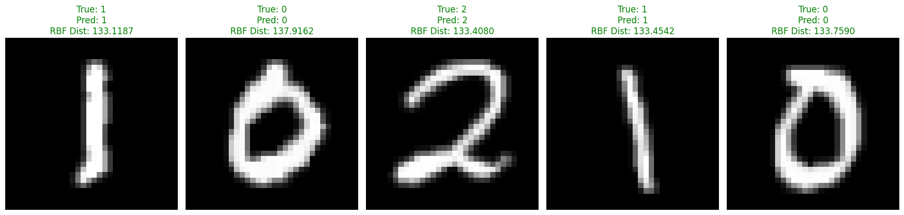

# LeNet_5-from-scratch in PyTorch


My working in-depth implementation of Yann LeCun's Masterpiece: [**the LeNet-5 CNN that started it all**](https://en.wikipedia.org/wiki/LeNet). This is the first project from my **Visual Scrambling** series in which I reimplement from scratch the most influential classic architectures and ending with a unique visual model design written and designed by me.

The point of the series is to go in more depth into the PyTorch framework and understand most importantly the broadcasting part, since at the writing of this readme, that's what I find the most difficult. In addition to that, another goal of this series is to promote understanding by writing and not solely by reading, since in these days, some can become a little bit too inclined into asking the latest LLMs for understanding and for implementation, leaving gaps in understanding. That's even why I decided to leave the repo as it is in it's "naked form" (anyone can play with the model and change the class of the model or even add more methods if they feel like it, that's why I leave it in this kind of infant form, with a notebook for testing and a script for model initialization, which may feel a little bit unorthodox for some)

## Layout

```
├── IMAGES
│   ├── Laura_Chaubard_&_Yann_Le_Cun_-_2024_(53814052697)_(cropped).jpg # photo of Yann LeCun    
│   ├── LeNet-5_architecture.svg # image of the LeNet-5 architecture    
│   ├── MNIST_dataset_example.png # image of MNIST dataset label examples
│   └── test_visual_predictions.png # model inference snippet output example
│
├── data/MNIST/raw (basic boilerplate torchvision MNIST import baseline)
│   ├── ...    
│   ├── ...    
│   └── ...    
├── src/            # model initialization code + weights
│   ├── __init__.py
│   ├── lenet5_model.pth
│   └── model.py
│
├── LICENSE # the MIT License of the project
│
├── README.md           # the repository's showcase
│
├── requirements.txt
│
├── test.ipynb # model training + loss visualization + confusion matrix & classification report computation + live inference snippet

```

## The architecture

Every layer is written out rather than pulled from a library, and the shapes are forced by the 32×32 input:

| Layer | Operation | Output | Trainable params |
| --- | --- | --- | --- |
| Input | 32×32 grayscale | `1 × 32 × 32` | — |
| **C1** | `Conv2d(1→6, 5×5)` + scaled tanh | `6 × 28 × 28` | 156 |
| **S2** | `AvgPool2d(2×2, stride 2)` | `6 × 14 × 14` | 0 |
| **C3** | `Conv2d(6→16, 5×5)` + scaled tanh | `16 × 10 × 10` | 2,416 |
| **S4** | `AvgPool2d(2×2, stride 2)` | `16 × 5 × 5` | 0 |
| **C5** | `Conv2d(16→120, 5×5)` + scaled tanh | `120 × 1 × 1` | 48,120 |
| **F6** | `Linear(120→84)` + scaled tanh | `84` | 10,164 |
| **Output** | 10 Euclidean RBF units | `10` distances | 0 (fixed) |
| | | **Total** | **60,856** |

C5 is written as a convolution rather than a linear layer on purpose. Its 5×5 kernel exactly covers the 5×5 input, so it collapses to 120×1×1 — mathematically fully connected, but keeping it a `Conv2d` makes that coincidence visible instead of hiding it behind a `flatten`.

The activation throughout is the paper's scaled hyperbolic tangent, `1.7159 · tanh(⅔x)`. The constants aren't arbitrary: they place the function's most useful gradient where normalized inputs actually live, and give `f(±1) = ±1`.

### The output layer has no softmax

This is the part of LeNet-5 that looks strangest to modern eyes, and it's the reason F6 has exactly **84** units.

Each of the ten output units is a **Euclidean radial basis function** holding a fixed 84-dimensional centre — and that centre is a stylized **7 × 12 bitmap** of the digit it represents (7 × 12 = 84), with `+1` for ink and `-1` for background. The unit outputs the squared distance between F6's activation and its template:

```
..###..  ...#...  .#####.  .#####.  ....##.  #######  ..####.  #######  ..###..  ..###..
.#...#.  ..##...  #.....#  #.....#  ...#.#.  #......  .#.....  .....#.  .#...#.  .#...#.
#.....#  .#.#...  ......#  ......#  ..#..#.  #......  #......  ....#..  #.....#  #.....#
#.....#  ...#...  .....#.  .....#.  .#...#.  #####..  #......  ....#..  .#...#.  #.....#
#.....#  ...#...  ....#..  ..###..  #....#.  .....#.  #####..  ...#...  ..###..  .#...#.
   0        1        2        3        4        5        6        7        8        9
```

The templates are **never trained** — they're registered as a buffer, so no optimizer can reach them. Training instead pushes F6 to *draw* the right bitmap. Three consequences follow:

* **A small output means a confident prediction**, so inference uses `torch.argmin`, not `argmax`.
* The 84-dimensional F6 representation can be reshaped into the same 7×12 layout used by the fixed output templates, giving a simple visual representation of the representation the network is learning.
* **The squash after F6 matters.** It bounds activations to ±1.7159, the same scale as the ±1 templates they're compared against.

The loss follows the paper's MAP criterion — the distance to the correct class, plus `log Σ e^(−distance)` over all classes. The second term stops the network from cheating by collapsing every distance to zero. There's a neat result buried in it: that expression is *exactly* cross-entropy over the negated distances, so the paper arrives at the standard objective from a completely different direction.

### Fidelity to the paper

The goal is a learning-oriented reimplementation that combines the original LeNet-5 ideas with modern PyTorch infrastructure, not a high score. The paper's own parameter table sums to **exactly 60,000**, being the original LeNet-5 parameter count reported for the particular architecture in the paper, which makes a useful checksum — this implementation sits at **60,856**, and the difference is entirely accounted for by two deliberate simplifications:

| | This repo | Paper | Δ |
| --- | --- | --- | --- |
| C3 connectivity | fully connected to all 6 S2 maps | 60 of 96 links via Table I | +900 |
| S2 / S4 | plain average pooling | trainable coefficient + bias, then squashed | −44 |
| | | | **+856** |

Also simplified: optimization is plain SGD rather than the paper's stochastic diagonal Levenberg-Marquardt, and the loss omits the small positive constant `j` inside the log. The learning-rate ladder in `fit()` *does* follow the paper — 0.0005 for two passes, then 0.0002, 0.0001, 0.00005 and 0.00001.

## The MNIST dataset


MNIST is the benchmark the 1998 paper itself was built around — 70,000 handwritten digits assembled from NIST's Special Database 1 and 3, remixed by LeCun, Cortes and Burges so that the training and test sets come from **disjoint groups of writers**. That last detail is the whole point of the dataset: a model cannot score well by memorizing one person's handwriting, because nobody who wrote a training digit wrote a test digit.

| | Images | Size | Channels | Classes |
| --- | --- | --- | --- | --- |
| Train | 60,000 | 28 × 28 | 1 (grayscale) | 10 (digits 0–9) |
| Test | 10,000 | 28 × 28 | 1 (grayscale) | 10 (digits 0–9) |

The classes are close to balanced but not exactly — in the training split digit `1` appears 6,742 times and digit `5` only 5,421, a spread of about 24%. It is small enough to ignore for training, but it is the reason a **per-class classification report** is worth reading over a single accuracy number: a model that quietly fails on `5`s loses less overall accuracy than one that fails on `1`s.

### Loading

`torchvision.datasets.MNIST` handles the download into [`data/MNIST/raw`](data/MNIST/raw), which is where the four canonical IDX binaries land — images and labels, train and test. They are not image files; each is a flat binary with a short header (magic number, count, rows, columns) followed by raw pixel bytes, which is why they need a reader rather than a plain `imread`.

```python
my_transform = transforms.Compose([
    transforms.Resize((32, 32)),  # Changes 28x28 to 32x32
    transforms.ToTensor(),
    transforms.Normalize(...)     # see "A note on normalization" below
])
```

`DataLoader(..., batch_size=64)` then yields exactly what the network expects:

```
Feature batch shape: torch.Size([64, 1, 32, 32])
Labels batch shape:  torch.Size([64])
```

### Why 32×32 and not 28×28

This is the one preprocessing step LeNet-5 genuinely requires. Trace the spatial dimensions through the architecture: C1's 5×5 valid convolution takes 32 → 28, S2 halves it to 14, C3's 5×5 takes 14 → 10, S4 halves it to 5. That final 5×5 is exactly what C5's 5×5 kernel needs to collapse the map to 120×1×1. **Feed a 28×28 image instead and the chain ends at 4×4**, C5's kernel no longer fits its input, and the forward pass fails outright. The 32×32 input is not an aesthetic choice — every layer width in `model.py` is derived from it.

I have justified two ways to get there:

* **Resize** (used here) — `transforms.Resize((32, 32))` rescales the digit itself with bilinear interpolation, so the strokes are enlarged to fill the larger canvas.
* **Pad** (the original paper) — centre the untouched 28×28 digit inside a 32×32 field of background pixels. LeCun's reasoning was that this keeps distinctive features like stroke endpoints and corners near the centre of the receptive field of the highest-level feature detectors, rather than pushed to the border where they are seen by fewer units.

Both produce a correctly shaped tensor and both train; the resize is a deliberate simplification, not an oversight.

### A note on normalization

`ToTensor()` alone scales pixels to `[0, 1]`, which is not what the network is tuned for. The paper normalizes so that background sits at **−0.1** and foreground at **1.175** — values chosen so the input has roughly zero mean and unit variance, which puts it in the steep, high-gradient part of the `1.7159 · tanh(⅔x)` curve rather than out on its flat tails. Since the RBF templates are ±1, keeping the whole signal path on a comparable scale matters more here than in a network that ends in a softmax.

To reproduce the paper's exact endpoints:

```python
transforms.Normalize(mean=[0.078431], std=[0.784314])  # maps 0 -> -0.1, 1 -> 1.175
```

[`test.ipynb`](test.ipynb) uses a fixed normalization chosen to approximately match the input scale used for the experiment:

```python
transforms.Normalize(mean=[0.1], std=[0.278])  # maps 0 -> -0.36, 1 -> +3.24
```

Both target roughly zero mean and unit variance; the paper simply pins the two endpoints instead of deriving them from the data.

## Experimental setup

The setup used for the reported LeNet-5 experiment is documented below. The objective is to demonstrate the implemented architecture and its original-style RBF output mechanism on MNIST, rather than maximize the final test accuracy with moden optimization techniques.

| | Category | Setting |
| --- | --- |
| Hardware | `CPU` |
| Software | `Python, PyTorch, torchvision` |
| Dataset | `MNIST` |
| Input | `1x32x32` |
| Epochs | `15` |
| Batch size | `64` |
| Optimizer | `SGD` |
| Initial Learning Rate | `0.0005` |
| Learning-rate schedule | `0.0005 → 0.0002 → 0.0001 → 0.00005 → 0.00001` |
| Loss | `Custom LeNet-5 RBF loss` |
| Activation | `Scaled tanh: 1.7159 · tanh(⅔x)` |
| Output | `10 fixed Euclidean RBF centers` |
| Checkpoint | `src/lenet5_model.pth` |

The learning-rate schedule follows the staged values described in the original LeNet-5 work, while the optimizer itself is moden PyTorch SGD rather than the stochastic diagonal Levenberg-Marquardt method used in the historical implementation.

Because at this current version the repository does not freeze every dependency version or record a complete deterministic seeding configuration for the published run, small numerical differences may occur when reproducing the experiment

### Results



**98.59% test accuracy** on the 10,000-image test set (in the included notebook run, other runs + custom seeding may deliver other values), trained with the notebook's loop over the full 60,000-image training split.

The single accuracy figure is the least interesting output, though. [`test.ipynb`](test.ipynb) also produces a **confusion matrix** and a **per-class classification report** with precision, recall and F1 for each digit — worth reading given the class imbalance noted above, and given that the RBF templates make some confusions more likely than others: digits whose 7×12 bitmaps overlap heavily are exactly the pairs the model has the least margin between.

For context, the paper reports 99.05% on MNIST — reached with the trainable subsampling, the C3 connection table and the second-order optimizer that this implementation deliberately simplifies. Landing slightly under it with those pieces removed is the expected outcome, and a more useful signal than chasing the number with modern tricks the paper never used.

## Limitations

This repository does not claim exact replication of the original 1998 LeNet-5 training system.

The main limitations are:
* The C3 layer uses full connectivity rather than the original sparse connection table.
* The S2 and S4 layers use standard fixed average pooling rather than the trainable subsampling functions described in the paper.
* The loss omits the small positive constant *j* appearing in the original formulation.
* MNIST images are resized from *28x28* to *32x32*: the original preprocessing centred the original digit inside a *32x32* field.
* Dependency versions are minimum-version specifications rather than a completely frozen environment

These are deliberate trade-offs for a small, readable educational repository whose primary purpose is understanding the architecture, tensor transformations, RBF output mechanism, and training process rather than reproducing the historical system exactly.

## Notes

* `model.py` is a ground-up PyTorch reimplementation of the LeNet-5 architecture studied from the original 1998 paper. It is not intended to reproduce the original implementation byte-for-byte; instead, it makes the architectural and mathematical ideas explicit using modern PyTorch infrastructure.
* The most deliberately preserved historical component is the **RBF output layer**: fixed 7x12 digit templates are stored as non-trainable buffers, the F6 representation is compared against them using squared Eucliden distance, and predictions are obtained with `argmin` rather than `argmax`
* The custom RBF loss is implemented directly rather than replacing the original formulation with a conventional softmax classification loss.
* `test.ipynb` showcases the dataset extraction & visualization, model training loop, loss evolution visualization using matplotlib, confusion matrix computation between the true labels and the predicted ones, a classification report to showcase precision, accuracy, recall and f1-score between the digit classes (from 0-9), and finally a live inference script to observe real sampling and prediction, results I personally find fascinating to say the least

## Lessons learned (informal)

* The biggest thing I wanted to understand was **broadcasting**. The RBF output layer made that unavoidable: the F6 representation has shape [batch, 84], while the ten fixed digit centers have shape [10, 84]. Unsqueezing them into [batch, 1, 84] and [1, 10, 84] makes PyTorch broadcast the subtraction into [batch, 10, 84], after which the final reduction produces one distance for every class.
* Working through the spatial dimensions was another useful exercise. The apparently arbitrary `32x32` input becomes much less arbitrary when tracing the network as `32 → 28 → 14 → 10 → 5 → 1`. Every dimension is forced by the next operation.
* The project also made the difference between a **modern classification head** and **the original LeNet-5 output design** much clearer to me. Instead of ending with logits and a softmax, the network learns an 84-dimensional representation that is compared against fixed visual prototypes.

## Credits
_(cropped).jpg) 

All lecture material inspired by [Yann LeCun](https://en.wikipedia.org/wiki/Yann_LeCun) — [LeNet series](https://en.wikipedia.org/wiki/LeNet).

- LeCun, Y., Bottou, L., Bengio, Y., & Haffner, P. (1998). [Gradient-based learning applied to document recognition](https://ieeexplore.ieee.org/document/726791/).

[See the original Levenberg-Marquardt algorithm, which was implemented in the original LeNet-5](https://en.wikipedia.org/wiki/Levenberg%E2%80%93Marquardt_algorithm)

## Image Credits

Some visual assets used in this repository are sourced from Wikimedia Commons:

- **Yann LeCun photograph** — Jérémy Barande, licensed under [CC BY-SA 2.0](https://creativecommons.org/licenses/by-sa/2.0/).
- **LeNet-5 architecture image** — Zhang, Aston; Lipton, Zachary C.; Li, Mu; Smola, Alexander J. Originally from [Dive into Deep Learning](https://github.com/d2l-ai/d2l-en). Licensed under [CC BY-SA 4.0](https://creativecommons.org/licenses/by-sa/4.0/). [Wikimedia Commons source](https://commons.wikimedia.org/wiki/File:LeNet-5_architecture.svg).
- **MNIST dataset example image** — Suvanjanprasai. Licensed under [CC BY-SA 4.0](https://creativecommons.org/licenses/by-sa/4.0/). [Wikimedia Commons source](https://commons.wikimedia.org/wiki/File:MNIST_dataset_example.png).

These third-party images are **not covered by this repository's MIT License**. Their respective copyright and licensing terms continue to apply.

## 🔗 More

- Author: [Pop Alexandru](https://github.com/pop123-ux)
- Medium write-ups: [medium.com/@Pop123](https://medium.com/@Pop123)
- Hugging Face: [pop123ux](https://huggingface.co/pop123ux)
